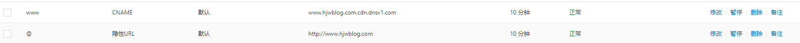

域名之前配过邮箱服务器解析，存在一个@的MX记录

然后在配置CDN的时候需要修改www和@的CNAME记录，提示“CNAME记录与MX记录冲突”。

了解了一下，CNAME优先级最高，所以在解析请求过程中，会优先返回CNAME解析记录结果，这样设置的结果导致用户无法请求到MX记录，直接对邮箱业务造成使用影响。

## 解决方法

可通过 配置主机记录为www的CNAME记录指向CDN，再配置主机记录为@的URL转发指向主机记录为www的域名 即可解决主机记录为@的CNAME和MX记录冲突问题。

如下：

