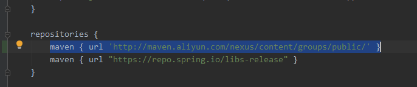

## 获取代码仓库链接

首先，我们找到 Spring 的 github 仓库`https://github.com/spring-projects/spring-framework`。

复制链接。

## 导入到idea

打开 IDEA , 如下图操作。

然后粘贴刚刚复制的仓库地址，选择一个位置

等待 clone 代码。

然后导入。

等待导入依赖。

我看的是5.0.x，checkout一下。

[

这时候 gradle import 可能报下面的错误。

这是因为 Gradle 版本不兼容。

打开 `gradle/wrapper/gradle-wrapper.properties` 文件，这里显示 gradle 版本是4.4.1。

将设置里面 use Gradle from 改成 `gradle-wrapper.properties`,IDEA 会自动下载需要的 Gradle。

导入包的过程很慢，可以配一下国内仓库来加快下载速度。打开`build.gradle`文件。在`repositories`标签里面加入`maven { url 'http://maven.aliyun.com/nexus/content/groups/public/' }`。

耐心等待 build。

然后根目录有一个`import-into-idea.md`文件，需要运行一个任务。我们运行一下。

然后`Reimport`一下。

最后是这个样子的。

