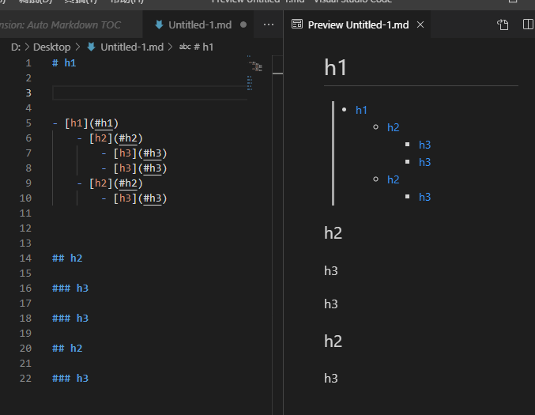

## 设置语言

```
Ctrl+Shift+p
```

输入

```
configure display language
```


`install additional languages`,安装中文.


再次重复上面的操作，选择`zh-cn`


重启后就是中午了。

## 生成Markdown目录

由于 github 不能通过 TOC 生成目录，但是可以通过工具生成链接目录。

打开vscode应用市场。

搜索安装`Auto Markdown TOC`。


然后就能生成目录了。


删除`<!-- /TOC -->`注释。



查看效果。